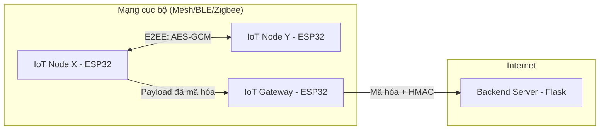

# Nghiên cứu & Thiết kế Kiến trúc Bảo mật IoT

Tài liệu này trình bày giải pháp bảo mật tầng ứng dụng cho hệ thống gồm: IoT Node (X, Y) -> Gateway -> Backend Server.

## 1. Kiến trúc Hệ thống (System Architecture)

## 2. Giải pháp Bảo mật cho các kịch bản

### A. Truyền thông Node-to-Node (X <-> Y)
- **Cơ chế:** Mã hóa đối xứng **AES-128-GCM**.
- **Quản lý khóa:** Sử dụng Khóa nạp sẵn (Pre-shared Key) hoặc ECDH.
- **Mục tiêu:** Đảm bảo chỉ Node X và Y đọc được nội dung, kẻ trung gian (kể cả Gateway) không thể can thiệp.

### B. Truyền thông Gateway-to-Server (Chuyển tiếp bảo mật)
Sử dụng cơ chế **Lớp phủ bảo mật (Security Overlay)**:
1. **Payload mã hóa:** Gateway giữ nguyên Payload đã mã hóa của Node (đảm bảo bảo mật đầu cuối).
2. **Xác thực Gateway:** Gateway thêm một trường chữ ký `Signature` (sử dụng HMAC-SHA256) với một khóa bí mật dùng chung giữa Gateway và Server.
3. **Mục tiêu:** Server xác định được bản tin đến từ Gateway hợp lệ và dữ liệu không bị sửa đổi trên đường truyền internet.

## 3. Thiết kế cấu trúc gói tin (Packet Structure)

Gói tin tổng quát khi gửi về Server:

| Offset | Trường dữ liệu | Độ dài | Mô tả |
| :--- | :--- | :--- | :--- |
| 0 | **Gateway ID** | 4 Bytes | Định danh Gateway gửi tin |
| 4 | **Nonce/IV** | 12 Bytes | Giá trị ngẫu nhiên cho AES-GCM |
| 16 | **Ciphertext** | Biến thiên | Dữ liệu cảm biến đã mã hóa (Node Key) |
| ?? | **Auth Tag** | 16 Bytes | Kiểm tra tính toàn vẹn của GCM |
| ?? | **Gateway HMAC**| 32 Bytes | Chữ ký của Gateway (Gateway Key) |

## 4. Quy trình xử lý tại Server (Flask)

1. **Nhận Request:** Flask nhận JSON chứa chuỗi mã hóa dạng Hex.
2. **Xác thực Gateway:** Kiểm tra HMAC bằng Gateway-Key. Nếu sai sẽ hủy bản tin ngay lập tức.
3. **Giải mã Payload:** Sử dụng Node-Key tương ứng để giải mã Ciphertext.
4. **Logic nghiệp vụ:** Kiểm tra số thứ tự (Sequence Number) và lưu vào cơ sở dữ liệu.
